**Проверенные сценарии:**
- проверка применения цветовой гаммы к виджету,
- проверка применения выбранной темы к виджету,
- работа дропдаунов,
- анализ UI,
- проверка адаптивности,
- встраивание в HTML-код сайта.

**Краткий чек-лист проверки:**
- проверить работу всех компонентов страницы,
- проверить встраивание в HTML-код сайта и отображение виджета при разных параметрах,
- проверить адаптивность при помощи Chrome DevTools,

**Найденные проблемы:**
- [При выборе красной цветовой гаммы в светлой теме превью генерируется в темной теме.](#баг-репорт-1)
- [Радиус скругления у блока с названием месяца не совпадает с радиусом скругления у блока мероприятий за месяц.](#баг-репорт-2)
- [Ссылка на сайт в превью не видна в темной теме.](#баг-репорт-3)
- [Шапка таблицы в превью перекрывается названиями месяцев при скролле.](#баг-репорт-4)
- [Темная нечитаемая шапка таблицы в превью в светлой теме.](#баг-репорт-5)
- [Нелокализовано название страны Macao.](#баг-репорт-6)
- [Ломается верстка встроенного в HTML-код сайта виджета при маленькой ширине.](#баг-репорт-7)
- Кнопка "Скопировать код" уменьшается после нажатия (не стала расписывать баг-репорт).

# Баг-репорт №1
## При выборе красной цветовой гаммы в светлой теме превью генерируется в темной теме

### Окружение
Google Chrome Версия: 149.0.7827.156.

### Шаги
1. Перейти на тестовую страницу.
2. В шаге 4 в светлой теме тап на радиобаттон с красным цветом.
3. Нажать кнопку "Сгенерировать превью".

### Фактический результат
При выборе красной цветовой гаммы в светлой теме превью генерируется в темной теме, цвет акцентных элементов не соответствует выбранному красному цвету.  
Ссылка в iframe не содержит параметра `theme`, как например в запросе для зеленой цветовой гаммы, только параметры `event_country` и `event_lang` (скрин для обоих тем прикладываю).

### Ожидаемый результат
При выборе красной цветовой гаммы в светлой теме превью генерируется в светлой теме, цвет акцентных элементов соответствует выбранному красному цвету.

### Критичность
Высокая

### Приложения
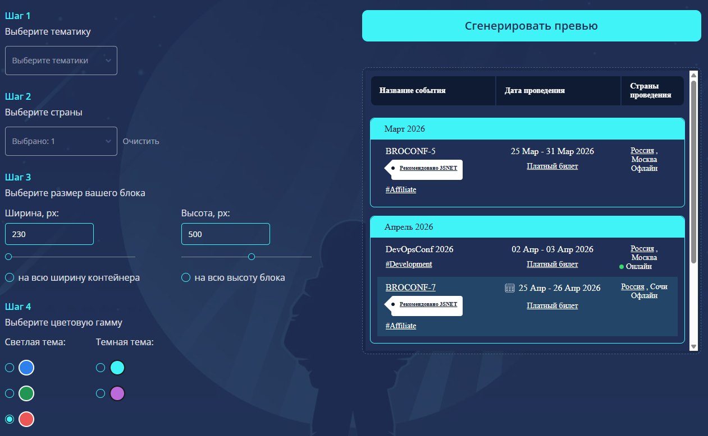

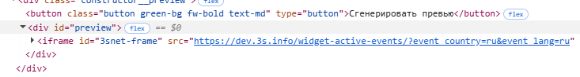

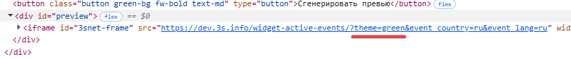

# Баг-репорт №2
## Радиус скругления у блока с названием месяца не совпадает с радиусом скругления у блока мероприятий за месяц

### Окружение
Google Chrome Версия: 149.0.7827.156.

### Шаги
1. Перейти на тестовую страницу.
2. Нажать кнопку "Сгенерировать превью".

### Фактический результат
Радиус скругления у блока с названием месяца не совпадает с радиусом скругления у блока мероприятий за месяц.

### Ожидаемый результат
Радиус скругления у блока с названием месяца совпадает с радиусом скругления у блока мероприятий за месяц.

### Критичность
Низкая

### Приложения
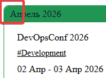

# Баг-репорт №3
## Ссылка на сайт в превью не видна в темной теме

### Окружение
Google Chrome Версия: 149.0.7827.156.

### Шаги
1. Перейти на тестовую страницу.
2. В шаге 4 выбрать любую цветовую гамму в темной теме.
3. Нажать кнопку "Сгенерировать превью".

### Фактический результат
Ссылка на сайт в превью после фразы "Календарь мероприятий предоставлен сайтом" не видна в темной теме.

### Ожидаемый результат
Ссылка на сайт в превью видна в темной теме, контрастный цвет шрифта.

### Критичность
Средняя

### Приложения
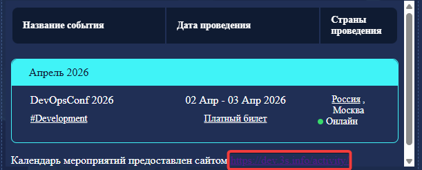

# Баг-репорт №4
## Шапка таблицы в превью перекрывается названиями месяцев при скролле

### Окружение
Google Chrome Версия: 149.0.7827.156.

### Шаги
1. Перейти на тестовую страницу.
2. Нажать кнопку "Сгенерировать превью".
3. Скроллить превью.

### Фактический результат
Шапка таблицы в превью перекрывается названиями месяцев при скролле.

### Ожидаемый результат
Шапка таблицы в превью не перекрывается названиями месяцев при скролле, названия месяцев скроллятся за шапкой.

### Критичность
Низкая

### Приложения
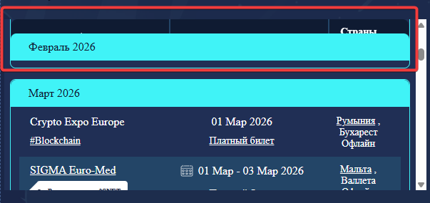

# Баг-репорт №5
## Темная нечитаемая шапка таблицы в превью в светлой теме

### Окружение
Google Chrome Версия: 149.0.7827.156.

### Шаги
1. Перейти на тестовую страницу.
2. В шаге 4 в светлой теме тап на радиобаттон с синим или зеленым цветом.
3. Нажать кнопку "Сгенерировать превью".

### Фактический результат
Темная нечитаемая шапка таблицы в превью в светлой теме, темный текст на темном фоне.

### Ожидаемый результат
Светлая шапка таблицы в превью в светлой теме, темный текст на светлом фоне.

### Критичность
Высокая

### Приложения
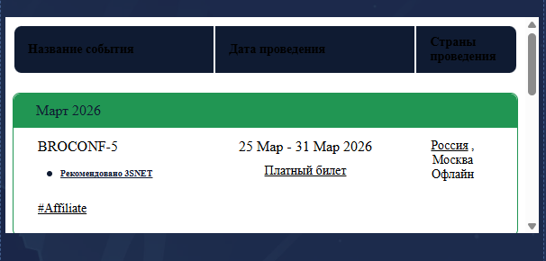

# Баг-репорт №6
## Нелокализовано название страны Macao

### Окружение
Google Chrome Версия: 149.0.7827.156.

### Шаги
1. Перейти на тестовую страницу.
2. В шаге 2 открыть дропдаун.

### Фактический результат
Нелокализовано название страны Macao.

### Ожидаемый результат
Название страны Macao локализовано.

### Критичность
Низкая

### Приложения
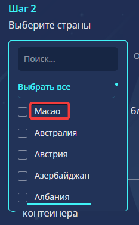

# Баг-репорт №7
## Ломается верстка встроенного в HTML-код сайта виджета при маленькой ширине

### Предусловия
Виджет с шириной 250 встроен в HTML-код сайта.

### Окружение
Google Chrome Версия: 149.0.7827.156.

### Шаги
1. Перейти на сайт из предусловий.

### Фактический результат
При встраивании виджета в HTML-код сайта при маленькой ширине виджета появляется горизонтальный скролл, текст и выделение строк выходит за рамки блоков месяцев.

### Ожидаемый результат
При встраивании виджета в HTML-код сайта при маленькой ширине виджета верстка адаптируется к ширине виджета.

### Критичность
Высокая

### Приложения
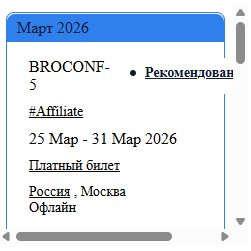

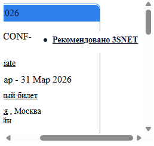

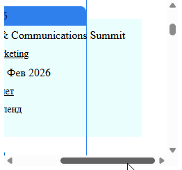
