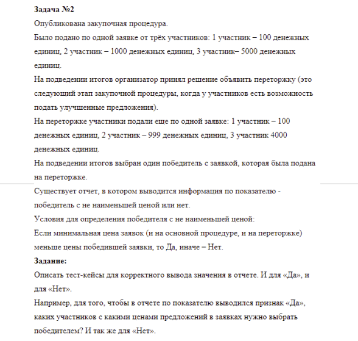

Задача
=

Решение
=

|Участник|Цена на основной процедуре|Цена на переторжке|
|-|-:|-:|
|1 участник|100|100|
|2 участник|1000|999|
|3 участник|5000|4000|
|**min**|**100**|**100**|

\* Из условия задачи не ясно, но предположим, что не должен победить участник, у которого на основной процедуре цена минимальна, а на переторжке нет.

Для того, чтобы в отчете по показателю "Победитель с не наименьшей ценой" выводился признак "Да", победителем надо выбрать участника, у которого и на основной процедуре, и на переторжке цена больше минимальной.

Для того, чтобы в отчете по показателю "Победитель с не наименьшей ценой" выводился признак "Нет", победителем надо выбрать участника, у которого на основной процедуре или на переторжке цена минимальна.

Позитивные кейсы в данном случае - участник 2 или 3. Негативный кейс - участник 1.

Для проверки условия со \* нужно добавить участника с минимальной ценой на основной процедуре и не минимальной ценой на переторжке (например с ценой на основной процедуре 50, с ценой на переторжке 200).

|Участник|Цена на основной процедуре|Цена на переторжке|
|-|-:|-:|
|1 участник|100|100|
|2 участник|1000|999|
|3 участник|5000|4000|
|4 участник|50|200|
|**min**|**50**|**100**|

Позитивные кейсы в данном случае - участник 2 или 3. Негативные кейсы - участник 1 или участник 4.